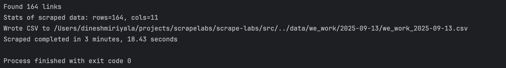

# WeWorkRemotely Job Scraper

This project is a robust Python scraper for extracting remote job listings from [WeWorkRemotely](https://weworkremotely.com/). It is designed to handle a variety of web scraping challenges such as rotating headers, retrying failed requests, parsing malformed JSON, cleaning HTML content, converting relative dates, and saving results in a structured format.

## Problems Solved

This scraper addresses several common web scraping issues:

- **Rotating Headers:** To avoid detection and blocking, the scraper rotates user-agent headers for each request.
- **Retries on Failure:** Implements retries for network or server errors to ensure reliable data collection.
- **Malformed JSON Handling:** Fixes common JSON formatting issues (e.g., trailing commas) before parsing.
- **Cleaning HTML Descriptions:** Extracts and cleans job descriptions from raw HTML.
- **Relative Date Conversion:** Converts human-readable relative dates (e.g., "2 days ago") to standard ISO date format.
- **Saving Results:** Stores the scraped job data in a CSV file for easy analysis.

## Key Code Snippets

### 1. Rotating Headers
```python
def rotate_header():
    headers = [
        {"User-Agent": "Mozilla/5.0 (Windows NT 10.0; Win64; x64)"},
        {"User-Agent": "Mozilla/5.0 (Macintosh; Intel Mac OS X 10_15_7)"},
        {"User-Agent": "Mozilla/5.0 (X11; Linux x86_64)"},
    ]
    return random.choice(headers)
```

### 2. Robust Response with Retries
```python
def robust_response(url, max_retries=3):
    for attempt in range(max_retries):
        try:
            response = requests.get(url, headers=rotate_header(), timeout=10)
            response.raise_for_status()
            return response
        except Exception as e:
            if attempt == max_retries - 1:
                raise
            time.sleep(2)
```

### 3. Fixing Malformed JSON with Regex
```python
def fix_malformed_json(text):
    # Remove trailing commas before } or ]
    text = re.sub(r',\s*([\}\]])', r'\1', text)
    return text
```

### 4. Parsing Relative Dates
```python
def parse_relative_date(text):
    now = datetime.datetime.utcnow()
    if "day" in text:
        days = int(re.search(r"(\d+)", text).group(1))
        return (now - datetime.timedelta(days=days)).date().isoformat()
    elif "hour" in text:
        hours = int(re.search(r"(\d+)", text).group(1))
        return (now - datetime.timedelta(hours=hours)).date().isoformat()
    # Add more rules as needed
    return now.date().isoformat()
```

### 5. Cleaning HTML Descriptions
```python
def description_parser(html):
    soup = BeautifulSoup(html, "html.parser")
    return soup.get_text(separator="\n").strip()
```

### 6. Saving to CSV
```python
def save_to_csv(rows, filename):
    with open(filename, "w", newline="", encoding="utf-8") as f:
        writer = csv.DictWriter(f, fieldnames=rows[0].keys())
        writer.writeheader()
        writer.writerows(rows)
```

## Sample Output

| Title                   | Company          | Location        | Date Posted | URL                                                |
|-------------------------|------------------|-----------------|-------------|----------------------------------------------------|
| Senior Python Engineer  | Acme Corp        | Worldwide       | 2024-06-12  | https://weworkremotely.com/remote-jobs/acme-python |
| Frontend Developer      | Widget Studios   | Europe Only     | 2024-06-11  | https://weworkremotely.com/remote-jobs/widget-frontend |
| DevOps Specialist       | Cloudify         | USA Only        | 2024-06-10  | https://weworkremotely.com/remote-jobs/cloudify-devops |

## Runtime Information

- **Run Details:**  
  `Found 164 links... Scrape completed in 3 minutes, 18.43 seconds`
- **Screenshot:**  
  

## Usage Instructions

1. **Install dependencies:**
    ```bash
    pip install -r requirements.txt
    ```
2. **Run the scraper:**
    ```bash
    python src/scrape_wework.py
    ```
3. **Find your results:**
    - Scraped CSV file: [](https://github.com/dineshmiriyala/scrape-labs/blob/main/data/2025-09-13/we_work_2025-09-13.csv)
    - Screenshot: [](https://github.com/dineshmiriyala/scrape-labs/blob/main/We_Work_Remotely/data/we_work/2025-09-13/output.png)

## Code Reference

- Main scraper script: [](https://github.com/dineshmiriyala/scrape-labs/blob/main/src/scrape_wework.py)